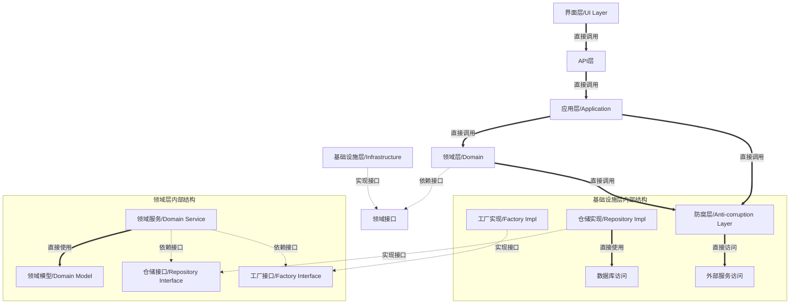

- entity
  - 充血模型 替代现有 entity 并增加状态更改

  - 贫血模型 value object 不可变
### repository
  - factory
  

```mermaid
graph TD
    UI[界面层/UI Layer]
    API[API层]
    APP[应用层/Application]
    DOMAIN[领域层/Domain]
    INFRA[基础设施层/Infrastructure]
    ACL[防腐层/Anti-corruption Layer]
    
    %% 强链接使用实线
    UI ==>|直接调用| API
    API ==>|直接调用| APP
    APP ==>|直接调用| DOMAIN
    APP ==>|直接调用| ACL
    DOMAIN ==>|直接调用| ACL
    
    %% 弱链接使用虚线
    DOMAIN -.->|依赖接口| DOMAIN_INTERFACE[领域接口]
    INFRA -.->|实现接口| DOMAIN_INTERFACE
    
    subgraph 领域层内部结构
        DOMAIN_MODEL[领域模型/Domain Model]
        DOMAIN_SERVICE[领域服务/Domain Service]
        REPOSITORY_INTERFACE[仓储接口/Repository Interface]
        FACTORY_INTERFACE[工厂接口/Factory Interface]
        
        %% 领域服务的依赖关系
        DOMAIN_SERVICE ==>|直接使用| DOMAIN_MODEL
        DOMAIN_SERVICE -.->|依赖接口| REPOSITORY_INTERFACE
        DOMAIN_SERVICE -.->|依赖接口| FACTORY_INTERFACE
    end
    
    subgraph 基础设施层内部结构
        REPOSITORY_IMPL[仓储实现/Repository Impl]
        FACTORY_IMPL[工厂实现/Factory Impl]
        DB[数据库访问]
        EXTERNAL[外部服务访问]
        
        %% 实现类与接口的关系
        REPOSITORY_IMPL -.->|实现接口| REPOSITORY_INTERFACE
        FACTORY_IMPL -.->|实现接口| FACTORY_INTERFACE
        %% 实现类的直接依赖
        REPOSITORY_IMPL ==>|直接使用| DB
        ACL ==>|直接访问| EXTERNAL
    end
```
