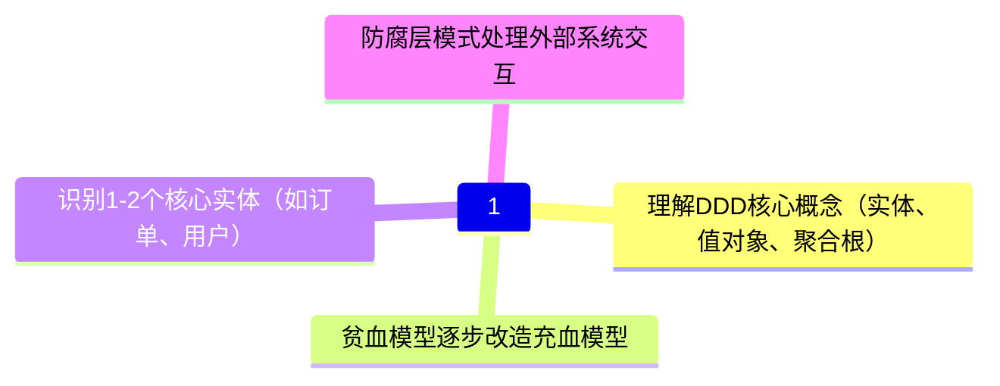
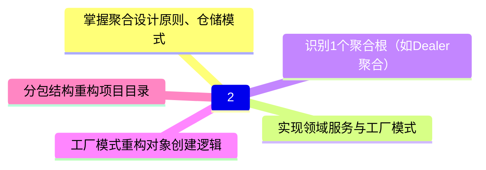
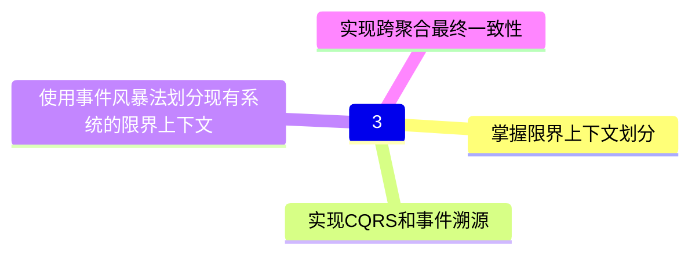
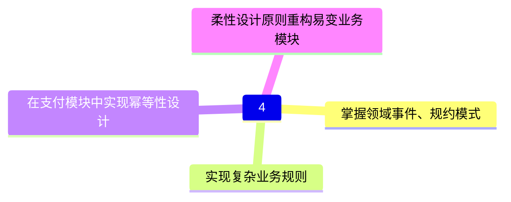
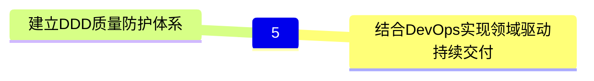

## 基础认知与贫血模型改造

### 理解DDD核心概念
- 实体(Entity)
  - 具有唯一标识
  - 生命周期管理
  - 状态变更追踪
- 值对象(Value Object)
  - 不可变性
  - 基于属性相等性
  - 无副作用操作
- 聚合根(Aggregate Root)
  - 一致性边界
  - 事务边界
  - 引用完整性

### 贫血模型改造
- 识别领域行为
  - 从CRUD操作中提取业务规则
  - 将业务规则封装到领域对象
  - 使用领域事件记录状态变更
- 领域对象设计
  - 封装内部状态
  - 提供领域方法
  - 实现不变量约束
- 领域服务设计
  - 处理跨对象业务逻辑
  - 协调多个聚合根
  - 封装外部依赖

### 核心实体识别
- 订单实体
  - 订单状态流转
  - 订单项管理
  - 支付状态追踪
- 用户实体
  - 用户认证
  - 权限管理
  - 个人信息维护

### 防腐层实现
- 外部系统适配
  - 接口转换
  - 数据映射
  - 异常处理
- 领域事件发布
  - 事件定义
  - 发布订阅
  - 异步处理

## 战术设计落地

## 战略设计与架构演进

## 复杂业务场景实战

## 工程化与效能提升工程化与效能提升

